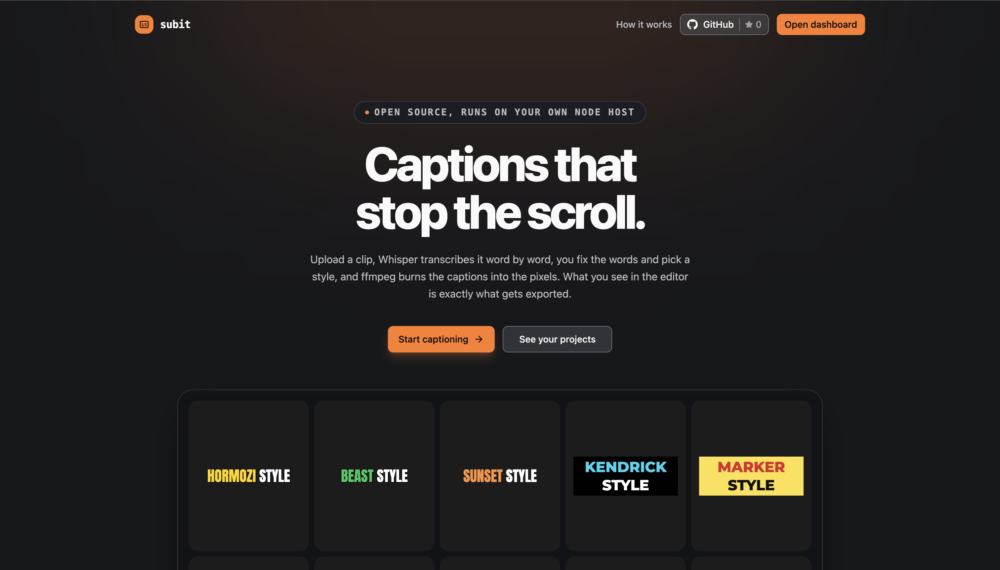
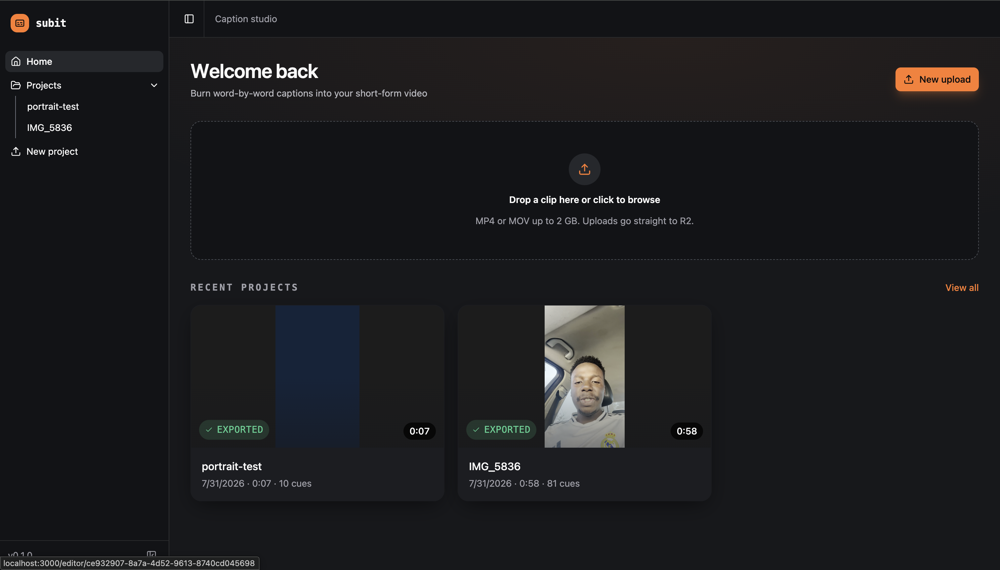
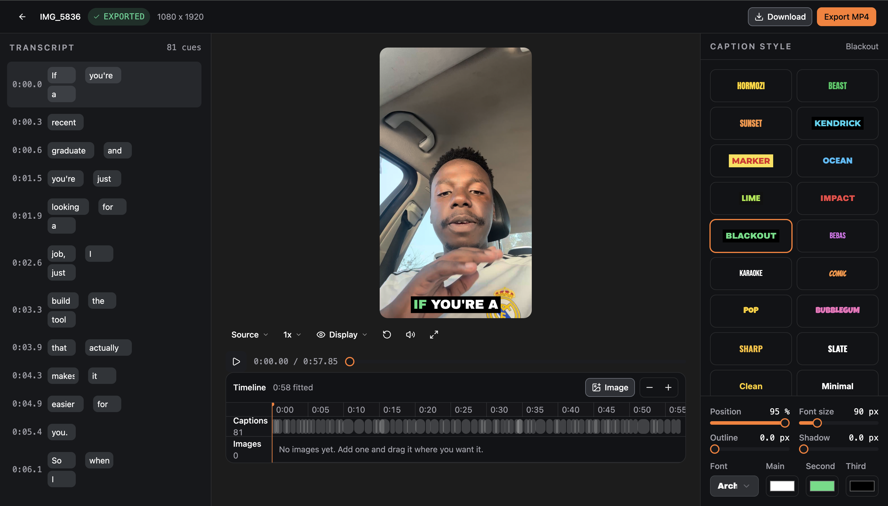

# Subit

Burn word-by-word captions into short-form video. Upload a clip, Whisper
transcribes it, you fix the words and pick a style, and ffmpeg renders an MP4
with the captions baked into the pixels.

The editor preview and the exported file share one positioning formula, so what
you see is what gets burned.



**Contents**

- [What it does](#what-it-does)
- [What runs where](#what-runs-where)
- [Run it locally](#run-it-locally) (start here)
- [Optional configuration](#optional-configuration)
- [Deploying](#deploying)
- [How a video moves through](#how-a-video-moves-through)
- [Preview and export agree by construction](#preview-and-export-agree-by-construction)
- [Known simplifications](#known-simplifications)
- [Project layout](#project-layout)
- [Scripts](#scripts)

## What it does

Drop a clip on the dashboard and it becomes a project. Uploads go straight from
the browser to R2, so the app server never handles the bytes.



The editor gives you the transcript on the left, a live preview in the middle,
and caption styles on the right. Fix a misheard word, pick a preset, drag the
caption block where you want it, then export.



## What runs where

Storage and database are Cloudflare. **The app itself is not a Worker.**

| Piece | Runs on | Why |
| --- | --- | --- |
| Video + exports | Cloudflare R2 | Presigned PUT straight from the browser, so uploads never touch the app server. |
| Project rows | Cloudflare D1 | Reached over the REST API, not a binding, because the app is a Node process. |
| Transcription | Groq Whisper | `whisper-large-v3-turbo`, word-level timestamps. |
| The app + rendering | **Any Node host** | `ffmpeg` is spawned as a native process. |

That split is why local setup needs a Cloudflare account and a Groq key. There
is no local-only mode: the upload path is presigned R2 and the project rows live
in D1.

## Run it locally

Eight steps, in order. Steps 3 to 5 are one-time account setup, so if you have
already done them, skip to step 6.

### 1. Install the prerequisites

- **Node 22+** and **pnpm 10+**
- **ffmpeg built with libass.** Non-negotiable: without it the `subtitles` filter
  does not exist and every export fails.

Homebrew splits ffmpeg into a slim `ffmpeg` (no libass) and a keg-only
`ffmpeg-full`. Install the full one:

```sh
brew install ffmpeg-full
```

On Debian or Ubuntu, the distro package already includes libass:

```sh
sudo apt install ffmpeg
```

Verify it either way. This must print a non-zero number:

```sh
ffmpeg -filters | grep -c subtitles
```

If it prints `0`, stop here and fix ffmpeg. Everything else can be set up
perfectly and exports will still fail.

If your binary is not on `PATH`, set `FFMPEG_BIN` and `FFPROBE_BIN` in step 6.
The resolver in `src/server/ffmpeg.server.ts` already checks the Homebrew keg
path (`/opt/homebrew/opt/ffmpeg-full/bin`) before falling back to `PATH`.

### 2. Clone and install

```sh
git clone https://github.com/fariraimasocha/subit.git
cd subit
pnpm install
```

### 3. Set up Cloudflare R2

Create a bucket, then set its CORS rules **before** your first upload. A missing
CORS rule fails as an opaque browser error with no server log, which is a
miserable thing to debug.

R2 > your bucket > Settings > CORS:

```json
[{"AllowedOrigins":["http://localhost:3000"],"AllowedMethods":["PUT","GET"],
  "AllowedHeaders":["content-type"],"ExposeHeaders":["etag"],"MaxAgeSeconds":3600}]
```

Do not add `content-length` to `AllowedHeaders`. The browser sets it implicitly
and Chrome rejects it as a custom header. It is still signed into the presigned
query, which is what makes R2 enforce the upload size.

Then mint an R2 token: R2 > Manage API tokens > Create token, with **Object Read
& Write** on that bucket. This gives you `R2_ACCESS_KEY_ID` and
`R2_SECRET_ACCESS_KEY`. These cannot be created from the CLI, only the dashboard.

Keep the bucket name and the S3 endpoint handy, you need both in step 6.

### 4. Set up Cloudflare D1

Create a database, then paste this into the D1 console once. There is no
migration runner, schema changes are a manual `ALTER TABLE`.

```sql
CREATE TABLE IF NOT EXISTS projects (
  id TEXT PRIMARY KEY,
  name TEXT NOT NULL,
  status TEXT NOT NULL DEFAULT 'uploaded',  -- uploaded|processing|ready|exporting|done|error
  src_key TEXT NOT NULL,
  norm_key TEXT, norm_url TEXT,
  width INTEGER, height INTEGER, duration REAL,
  cues_json TEXT,      -- JSON Cue[]
  theme_json TEXT,     -- full Theme snapshot, not an id
  overlays_json TEXT,  -- JSON Overlay[], the images on the timeline
  poster_url TEXT,     -- one frame from the clip, for the project card
  export_url TEXT, error TEXT,
  stage TEXT,          -- normalising|uploading|transcribing|grouping
  user_id TEXT,        -- Better Auth user.id, scopes the dashboard list
  created_at INTEGER NOT NULL
);
```

`stage` is easy to miss: `PLAN.md` predates it and the live database picked it up
through a later `ALTER TABLE`. Leave it out and ingest fails on the first status
write.

Then create an account API token: My Profile > API Tokens > Create token, with
**D1 Edit** on this account. That is `CLOUDFLARE_API_TOKEN`, and it is a
different credential from the R2 keys in step 3. Copy the database ID too.

<details>
<summary>Upgrading a database created before the timeline shipped</summary>

Two columns were added later. Run them once:

```sql
ALTER TABLE projects ADD COLUMN overlays_json TEXT;
ALTER TABLE projects ADD COLUMN poster_url TEXT;
ALTER TABLE projects ADD COLUMN user_id TEXT;
CREATE INDEX IF NOT EXISTS projects_user_id_idx ON projects (user_id);
```

Rows without `overlays_json` read as "no images", so nothing breaks until you
drop an image on the timeline and the save fails. Rows without `poster_url` fall
back to a placeholder on the project card; new uploads get a poster during
ingest, and older ones only get one if you re-run ingest from the editor's Retry.

</details>

### 5. Get a Groq key

Get one from [console.groq.com](https://console.groq.com). The free tier is
enough to transcribe plenty of clips.

### 6. Write `.env.local`

Create `.env.local` in the project root and fill in what you collected above:

```sh
# Cloudflare account, from R2 > Overview or any dashboard URL
CLOUDFLARE_ACCOUNT_ID=
# R2 S3 endpoint, e.g. https://<account>.r2.cloudflarestorage.com
# Accepted with or without the bucket name on the end.
CLOUDFLARE_S3_API=
R2_BUCKET=

# Step 3: R2 > Manage API tokens (Object Read & Write on the bucket)
R2_ACCESS_KEY_ID=
R2_SECRET_ACCESS_KEY=

# Step 4: My Profile > API Tokens, with D1 Edit on this account
CLOUDFLARE_API_TOKEN=
D1_DATABASE_ID=

# Step 5
GROQ_API_KEY=
```

Those eight are required. Everything else has a default, see
[Optional configuration](#optional-configuration).

### 7. Start the dev server

```sh
pnpm dev
```

Open <http://localhost:3000>. The dashboard should show an empty project list.

If you get a setup checklist instead, a variable in `.env.local` is missing or
misspelled, and the checklist names which one. That screen is deliberate: a fresh
clone with missing credentials explains itself rather than throwing a failed
request. See `src/components/setup-notice.tsx`.

### 8. Verify with one real upload

The checklist only proves the variables are present, not that they work. Upload
a short clip and let it run through to an export. That single pass exercises
every credential, and each stage fails in a distinct place:

| It fails at | Look at |
| --- | --- |
| Upload, no server log | R2 CORS rules from step 3, and that `AllowedOrigins` includes `http://localhost:3000` |
| Upload, 403 | `R2_ACCESS_KEY_ID` / `R2_SECRET_ACCESS_KEY`, and that the token covers this bucket |
| Normalising | ffmpeg on `PATH`, or set `FFMPEG_BIN` / `FFPROBE_BIN` |
| Transcribing | `GROQ_API_KEY` |
| Saving the project | `CLOUDFLARE_API_TOKEN` (needs D1 Edit), `D1_DATABASE_ID`, and the `projects` table from step 4 |
| Export | `ffmpeg -filters \| grep -c subtitles` printing 0, so libass is missing |

Ingest and export run detached from the request, so the server has to stay up
while a job runs. Restarting it mid-job loses the job, and the editor offers a
Retry.

## Optional configuration

| Variable | Default | What it does |
| --- | --- | --- |
| `R2_PUBLIC_URL` | blank | Public bucket URL (`https://pub-xxxx.r2.dev` or a custom domain). Left blank, `publicUrl()` falls back to a 7 day presigned GET, which works without enabling public access. Never point this at the S3 API endpoint: those URLs need signing and the browser just gets a 400. |
| `EXPORT_ENCODER` | `libx264` | Export video encoder. `h264_videotoolbox` is faster on Apple silicon but visibly loses detail on caption edges. |
| `FFMPEG_BIN` / `FFPROBE_BIN` | auto | Explicit binary paths, if the Homebrew keg and `PATH` both miss. |
| `GITHUB_REPO` | `fariraimasocha/subit` | Repo behind the landing page star count. |
| `GITHUB_TOKEN` | blank | Lifts the GitHub API limit from 60/hour to 5000/hour. Only needed if the star count rate-limits. |
| `PORT` | `3000` | Production port for `pnpm start`. |

## Deploying

Build and run it as a normal Node process:

```sh
pnpm build
pnpm start
```

The host needs a long-lived process and ffmpeg with libass on it. A VPS, Fly,
Render or Railway all work. R2 and D1 are reached over HTTPS from wherever that
is, so the environment variables are the same ones as local, with
`AllowedOrigins` in the R2 CORS rules updated to your real domain.

Two things put plain serverless (Workers, Vercel) off the table for the app
process itself:

1. Rendering shells out to a real `ffmpeg` binary (`src/server/ffmpeg.server.ts`).
   In a Worker, `node:child_process` is a unenv polyfill that throws at runtime.
2. Ingest and export run detached from the request that started them
   (`src/server/jobs.server.ts`). Serverless freezes the function once the
   response is sent, which would kill every job mid-flight.

Cloudflare **Containers** is a way around both, since it runs a real Docker image
with a real Node process. It needs a base image with ffmpeg built with libass,
and a Container class that calls `renewActivityTimeout()` so a long export does
not get put to sleep as idle. R2 and D1 need no changes, the app already talks to
both over HTTPS rather than through bindings.

## How a video moves through

1. **Upload.** The browser gets a presigned PUT and sends the file straight to
   R2. The app server never receives the bytes.
2. **Normalize.** One ffmpeg pass solves four problems at once: containers Chrome
   will not play (MOV, HEVC, ProRes), iPhone rotation metadata (baked into pixels
   here, so pixels and caption coordinates finally agree), ambiguous ffprobe
   dimensions, and oversized resolution (capped at 1920).
3. **Transcribe.** Audio is extracted as 16 kHz mono FLAC and sent to Groq.
   That is roughly 18 KB/s, so Groq's 25 MB cap works out to about 23 minutes
   per request; longer clips are chunked.
4. **Edit.** Fix misheard words, pick a caption preset, drag the caption where
   you want it.
5. **Export.** Cues become an ASS subtitle file, ffmpeg burns it in with libass,
   and the result goes back to R2.

Ingest and export both run detached and report progress through a polled
in-memory job map.

## Preview and export agree by construction

Two renderers draw the same captions: a DOM overlay in the browser
(`src/components/caption-overlay.tsx`) and an ASS subtitle file burned by libass
(`src/lib/ass.ts`). They stay honest because every number in both comes from one
`metrics()` call in `src/lib/theme.ts`, as a percentage of the frame height.

Both anchor the caption block on its vertical centre: CSS uses
`translate(-50%, -50%)`, ASS uses `Alignment 5`. The export then subtracts a
small per-font baseline shift, because CSS centres text on hhea metrics while
libass uses the OS/2 win pair. Without that correction the burn sits a few pixels
off from the preview. `src/lib/ass.test.ts` pins those numbers down.

One known gap: the aspect selector (9:16, 1:1, 16:9) crops the **preview** only.
The export always keeps the source frame, so on anything other than Source the
same position percentage lands differently.

## Known simplifications

- **Jobs live in an in-memory Map.** Restart the server mid-export and the job
  vanishes; the UI says so and offers a retry. Fixing it properly means a jobs
  table plus a reaper, which is a queue.
- **No migration runner.** Schema changes are a manual `ALTER TABLE` in the D1
  console.
- **One row per project**, transcript and theme stored as JSON. The transcript is
  always read and written whole and never queried by word. A 20 minute transcript
  is about 150 KB against D1's 2 MB row limit, so the ceiling is roughly 4 hours
  of speech.
- **No temp file reaper.** macOS clears `/tmp` on reboot; a long-running VPS
  eventually wants a `tmpreaper` cron.

## Project layout

```
src/
  routes/          file-based routing, dashboard + editor
  components/      shadcn/ui base, caption overlay, style panel
  lib/             theme, cues, ASS generation (shared, client-safe)
  server/          *.server.ts, unreachable from client code by build rule
  store/           zustand editor state
public/fonts/      TTFs shipped to libass at burn time
serve.ts           the only runtime-specific file in the repo
```

`vite.config.ts` sets `importProtection`, so any client module importing a
`*.server.ts` file is a build error rather than a runtime surprise.

## Scripts

| Command | What it does |
| --- | --- |
| `pnpm dev` | Dev server on http://localhost:3000 |
| `pnpm build` | Production build into `dist/` |
| `pnpm start` | Serve the build, honours `PORT` |
| `pnpm test` | `node:test`, no test framework |
| `pnpm typecheck` | `tsc --noEmit` |
